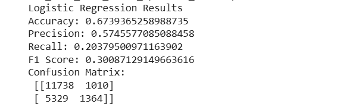
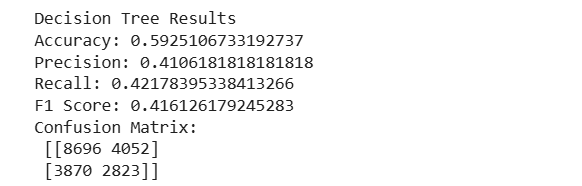
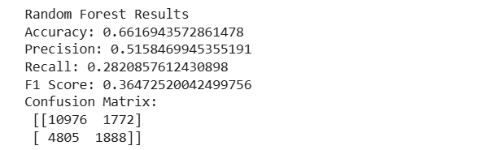
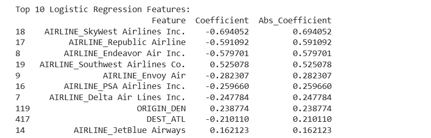
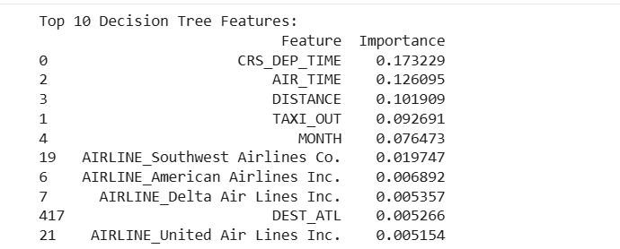
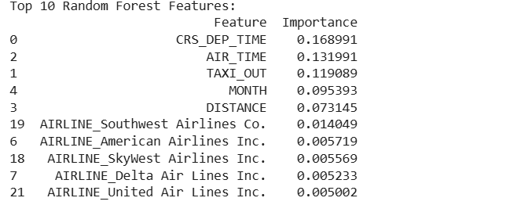

# ✈️ Flight Delay Prediction


A machine learning project that predicts whether a flight will experience a departure delay using historical U.S. domestic flight data. The project demonstrates data preprocessing, feature engineering, supervised machine learning, model evaluation, and feature importance analysis using Scikit-learn.

---

# Project Highlights

- Predicts flight departure delays using supervised machine learning.
- Compares the performance of Logistic Regression, Decision Tree, and Random Forest models.
- Performs feature engineering and one-hot encoding for categorical variables.
- Evaluates models using Accuracy, Precision, Recall, F1 Score, and Confusion Matrix.
- Analyzes the most influential features contributing to flight delay prediction.

---

# Overview

The objective of this project is to classify flights as **Delayed** or **On Time** using operational flight information such as airline, scheduled departure time, distance, air time, taxi-out time, origin airport, and destination airport.

The project follows a complete machine learning workflow including:

- Data preprocessing
- Feature engineering
- Model training
- Model evaluation
- Feature importance analysis

Three supervised learning algorithms were implemented and compared:

- Logistic Regression
- Decision Tree
- Random Forest

---

# Dataset

**Dataset Name**

Flight Delay and Cancellation Dataset (2019–2023)

**Source**

https://www.kaggle.com/datasets/patrickzel/flight-delay-and-cancellation-dataset-2019-2023

The original dataset is approximately **614 MB** and is therefore **not included in this repository** due to GitHub file size limitations.

This project uses the dataset file:

```
flights_sample_3m.csv
```

For model training and evaluation, the first **100,000 records** were selected.

---

# Technologies Used

- Python
- Pandas
- NumPy
- Scikit-learn
- Google Colab

---

# Data Preprocessing

The dataset was prepared before training using the following preprocessing steps:

- Selected relevant flight-related attributes.
- Converted `FL_DATE` to DateTime format.
- Extracted the **Month** feature from the flight date.
- Created the binary target variable `IS_DELAYED`.
- Removed unnecessary columns.
- Applied One-Hot Encoding to categorical variables.
- Removed missing values.
- Split the dataset into training and testing sets (80:20).

---

# Features Used

The following features were used for model training:

- Flight Date
- Scheduled Departure Time
- Distance
- Air Time
- Taxi Out Time
- Airline
- Origin Airport
- Destination Airport
- Departure Delay (used to generate the target label)

---

# Machine Learning Models

## Logistic Regression

A linear classification algorithm used as the baseline model for flight delay prediction.

## Decision Tree

A tree-based classification model trained using balanced class weights to reduce the impact of class imbalance.

## Random Forest

An ensemble learning algorithm consisting of **100 decision trees**, trained with balanced class weights to improve predictive performance and generalization.

---

# Model Performance

| Model | Accuracy | Precision | Recall | F1 Score |
|--------|---------:|----------:|-------:|---------:|
| Logistic Regression | **67.39%** | **57.46%** | 20.38% | 30.09% |
| Decision Tree | 59.25% | 41.06% | **42.18%** | **41.61%** |
| Random Forest | 66.17% | 51.58% | 28.21% | 36.47% |

### Summary

- Logistic Regression achieved the highest overall accuracy.
- Decision Tree achieved the highest Recall and F1 Score.
- Random Forest delivered competitive overall performance while providing robust feature importance analysis.

---

# Feature Importance

Feature importance analysis was performed to identify the variables that contributed most to flight delay prediction.

The most influential features included:

- Scheduled Departure Time
- Air Time
- Taxi Out Time
- Distance
- Month
- Airline
- Origin Airport
- Destination Airport

These features consistently had the greatest influence on model predictions.

---

# Project Workflow

1. Load the dataset
2. Select relevant features
3. Perform preprocessing and feature engineering
4. Encode categorical variables
5. Split the dataset into training and testing sets
6. Train Logistic Regression model
7. Train Decision Tree model
8. Train Random Forest model
9. Evaluate model performance
10. Analyze feature importance

---

# Repository Structure

```
FlightDelayPrediction
│
├── FlightDelayPrediction.ipynb
├── README.md
├── .gitignore
└── screenshots
    ├── logistic_regression_results.png
    ├── decision_tree_results.png
    ├── random_forest_results.png
    ├── logistic_regression_features.png
    ├── decision_tree_features.png
    └── random_forest_features.png
```

---

# Results

## Logistic Regression



## Decision Tree



## Random Forest



## Logistic Regression Feature Importance



## Decision Tree Feature Importance



## Random Forest Feature Importance



---

# Future Improvements

- Train the models using the complete dataset instead of a sample.
- Apply feature scaling to improve Logistic Regression convergence.
- Perform hyperparameter tuning using Grid Search or Randomized Search.
- Evaluate additional machine learning algorithms such as XGBoost and LightGBM.
- Incorporate additional flight-related features, such as weather conditions and airport congestion, to improve prediction accuracy.

---

# Author

**Hooria Laiba**

Software Engineering Graduate

University of the Punjab (PUCIT)
